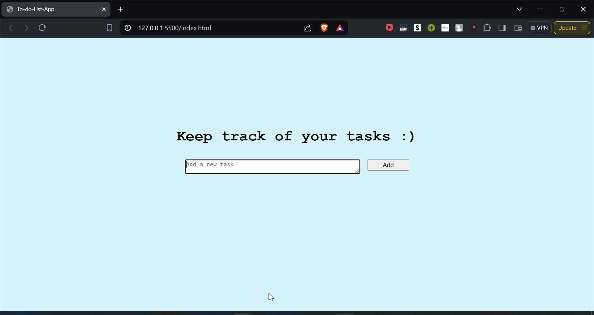
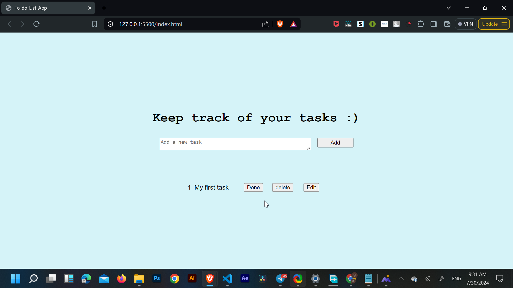
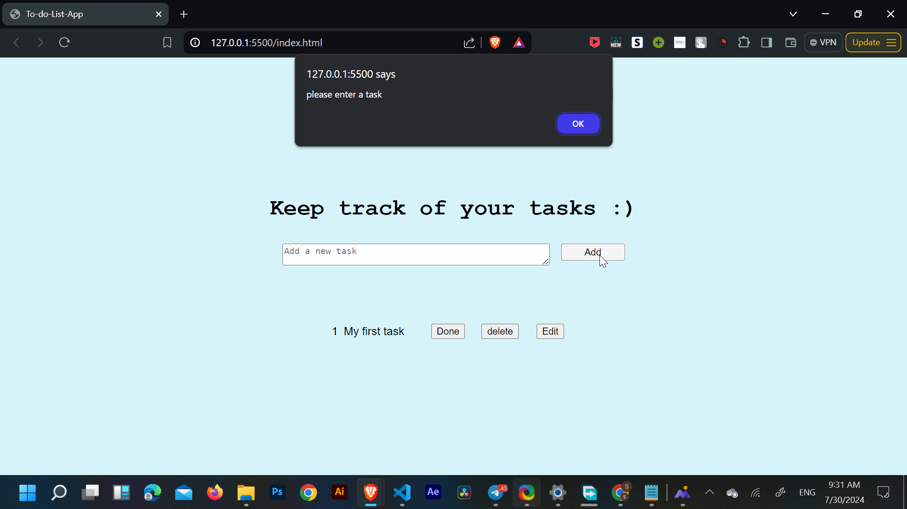
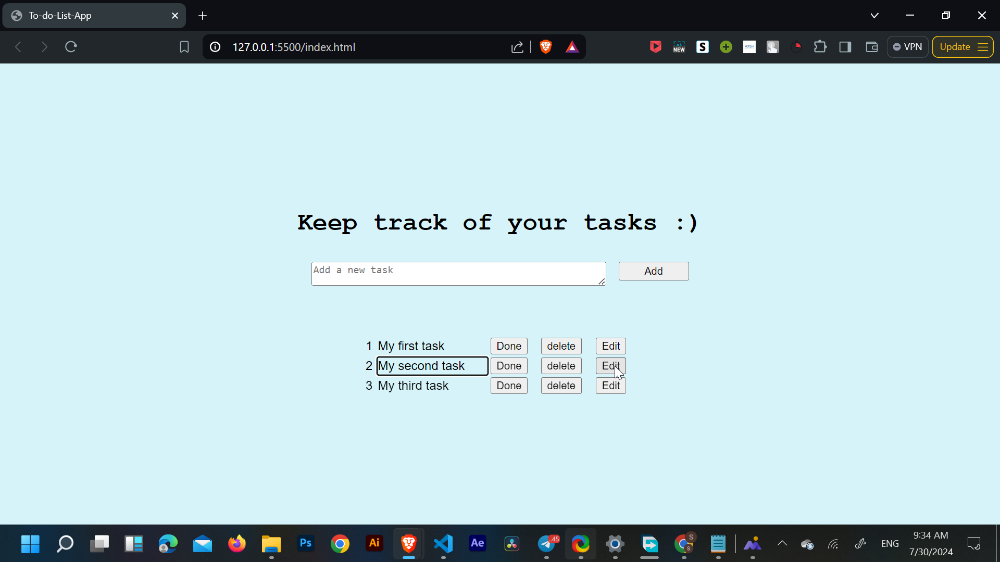
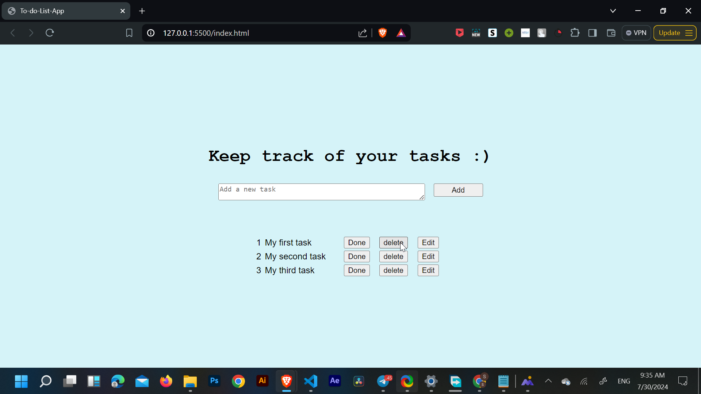
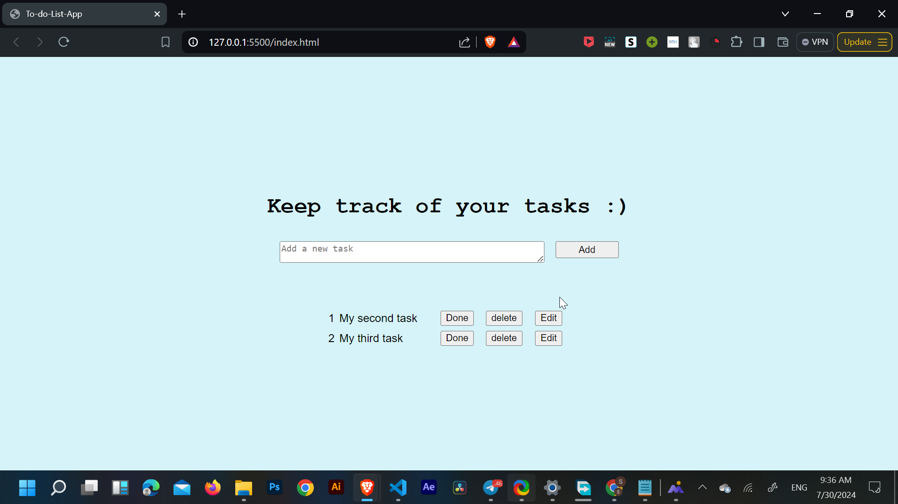

# To do List - 1
-------------

This is the interface of the application. It prompts the user to enter any task available to accomplish.

Adding a task and pressing the add button will add the task below in a table format with three functional buttons: Done, Delete, and Edit.

When the user tries to add an empty task, it will alert them to add a task first.

Pressing the Done button will mark the task with a strikethrough to indicate the task is completed.

Pressing the Edit button will change the normal text content of the task to an editable text field, and pressing it back will return it to its original state.

  

The Delete button is there to remove the task from the site completely. While deleting the row, the number of the table will automatically rearrange, for example, the second task will become the first after deleting the first task.

