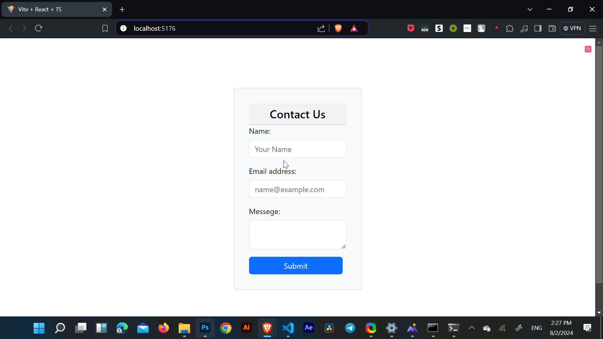
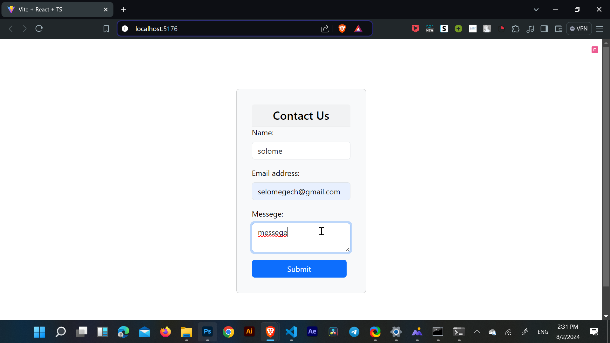
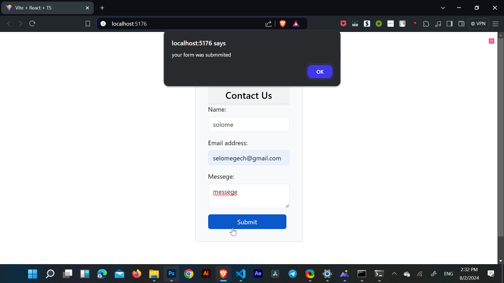
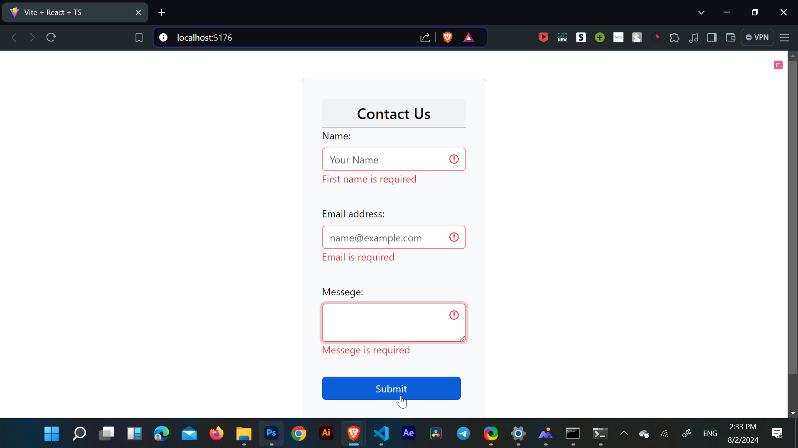
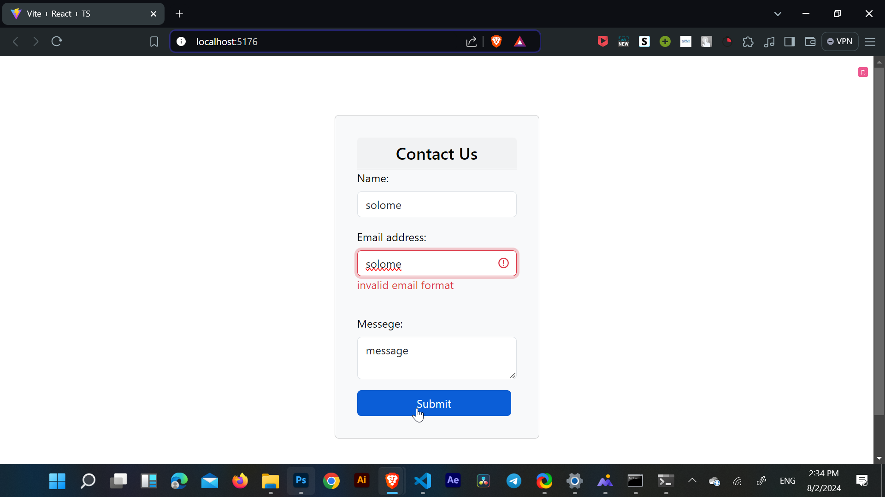

# Form using React-hooks
-------------

This is the interface of the application. It prompts the user to enter three values name , email and messege.

 The user can enter a valid information without any warnings.

Pressing the Submit button with a valid information will alert the user the form was submmited successfully.

 
other wise if the fiels are empty and the user tries to submit it will popup a warnin messege as shown above

filling the email spot with an invalid email adress will also give the user a warning.

