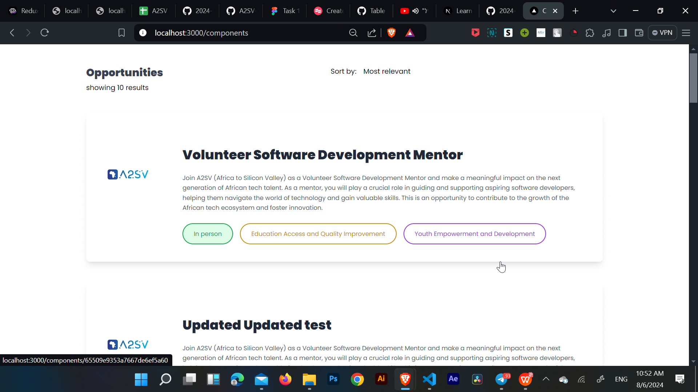
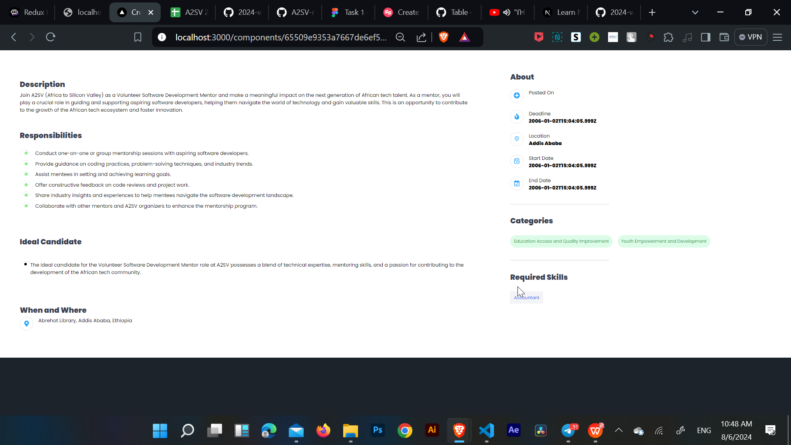

# Job Listing Application

## Introduction
This project is a part of a series of tasks aimed at building a comprehensive job listing application using React and Tailwind CSS. In this specific task (Task 6), the focus was on creating a job card component and populating it with dummy data, as well as setting up the job listing dashboard.

## Features
- Responsive job card component with a visually appealing design
- Utilization of dummy JSON data to populate the job cards
- Incorporation of an avatar image within the job card
- Creation of a job listing dashboard using Tailwind CSS

## Technologies Used
- React
- Tailwind CSS
- Dummy JSON data
- DaisyUI
- Google Fonts(inter)
- React icons

## Installation and Setup
1. Clone the repository: `git clone https://github.com/Selomegech/2024-web-internship-tasks/tree/main/task-6`
2. Navigate to the project directory: `cd task-6`
3. Install dependencies: `npm install`
4. Start the development server: `npm start`
5. Open the application in your browser at `http://localhost:3000`

## Usage
The job listing application allows users to view a list of job postings. Each job posting is displayed as a card, which includes the job title, category, location, and other relevant information. Users can interact with the job cards to explore the details of each job.

## Screenshot

## Acknowledgements
The dummy JSON data used in this project was provided as part of the task instructions.
